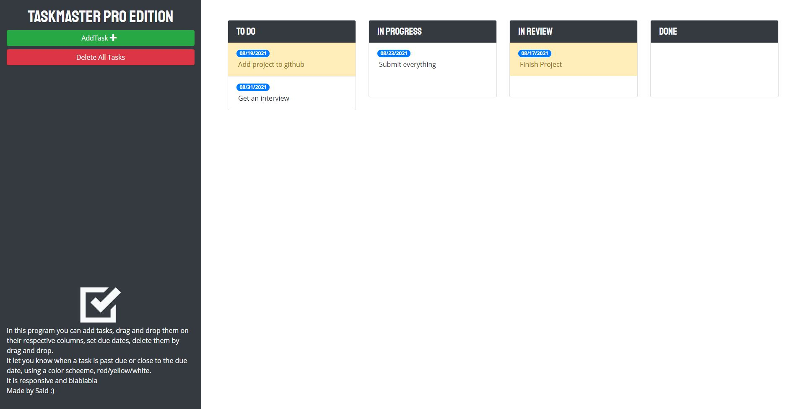

<!-- PROJECT TITE -->
  <h1 align="center">Task Master Pro Edition</h1>
  
  <!-- DESCRIPTION -->
  

  Aplication to add, edit and control Taks, its made responsive and with a polish UI

  <!-- DEPLOYED LINK -->
  Live Page: https://saidhadad.github.io/TaskMaster-Pro/
   
  GitHub repository URL: https://github.com/SaidHadad/TaskMaster-Pro

  <!-- TABLE OF CONTENTS -->
  

  
Table of Contents

  <ol>
  <li><a href="#about-the-project">About The Project</a></li>
  <li><a href="#built-with">Built With</a></li>
  <li>
    <a href="#getting-started">Getting Started</a>
    <ul>
    <li><a href="#prerequisites">Prerequisites</a></li>
    <li><a href="#installation">Installation</a></li>
    </ul>
    </li>
  <li><a href="#contributing">Contributing</a></li>
  <li><a href="#license">License</a></li>
  <li><a href="#contact">Contact</a></li>
  </ol>
  

  
  
  <!-- ABOUT THE PROJECT -->
  ## About The Project

    
  Task Master Pro Application to control and organize tasks.
  
  ## Built With

  * JavaScript
  * HTML
  * CSS
  
  <!-- GETTING STARTED -->
  
  ## Getting Started

  ### Prerequisites

  No pre-requisites needed

  ### Installation

  Just launch the program or visit the GitHub pages, to use drag and drop the tasks, or add new tasks on the buttons to the left

  <!-- CONTRIBUTING -->
    
  <!-- LICENSE -->
  
  ## License

 

[MIT License](https://choosealicense.com/licenses/mit/)  
  
  <!-- CONTACT -->
  
  ## Contact
  Name: Said David Hadad  
  Email: saiddavid.hadad@gmail.com  
  GIT: https://github.com/SaidHadad  